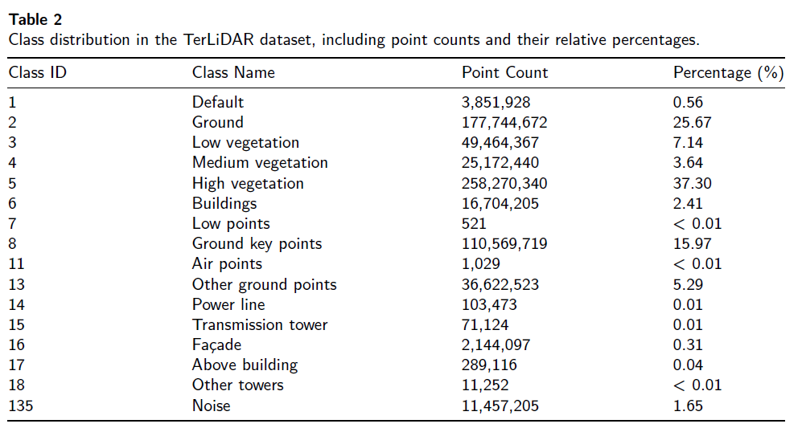
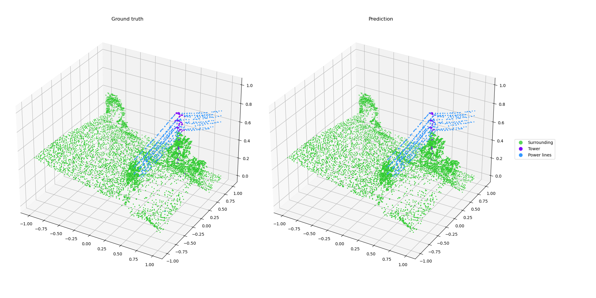
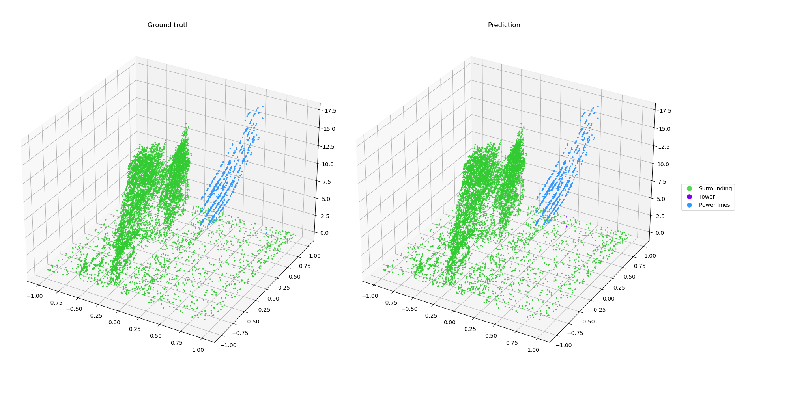
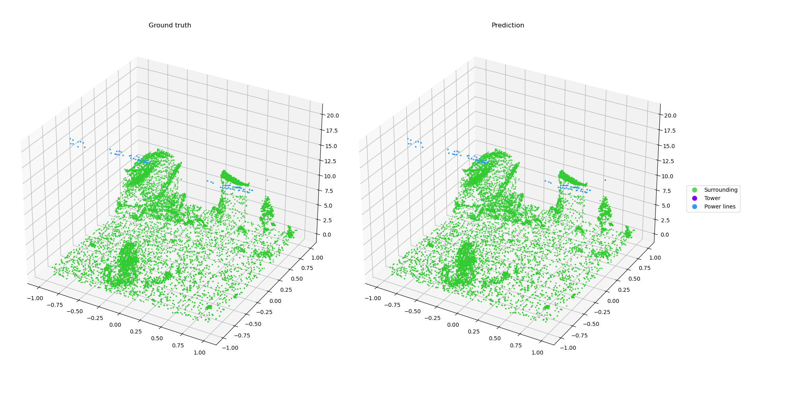
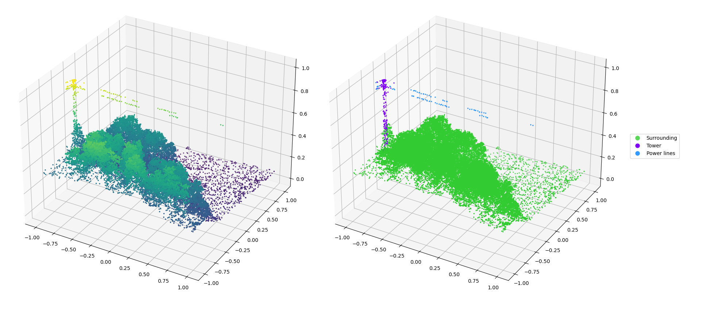
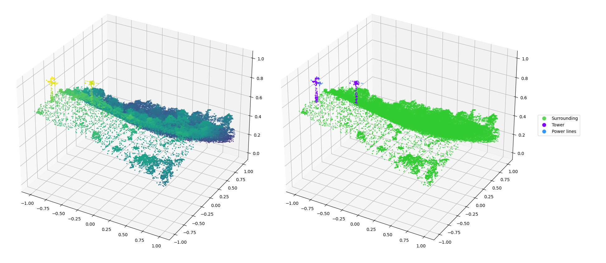
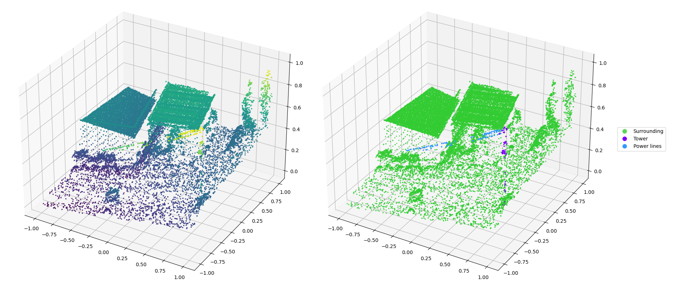
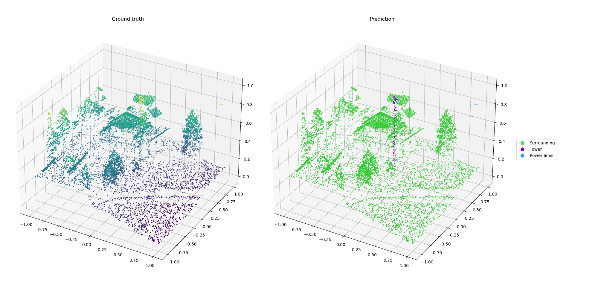
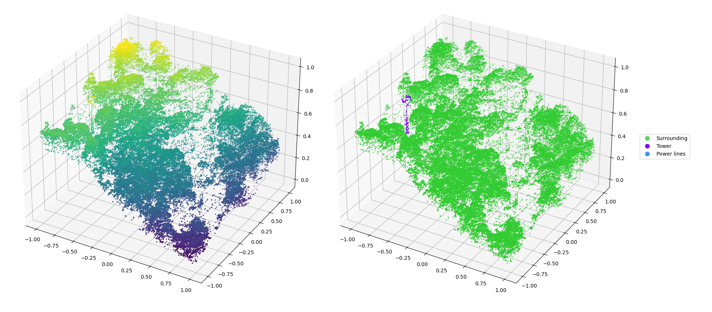

# TerLiDAR Dataset & Our work in LoRA for PointNet++ in Airborne LiDAR Semantic Segmentation

> Parameter‑efficient fine‑tuning (LoRA) for 3D point cloud semantic segmentation with PointNet++, evaluated on airborne LiDAR datasets.

[](#license)
[](https://creativecommons.org/licenses/by/4.0/)
[]()
[]()


## ⬇️ TerLiDAR Dataset Download

Please respond to the form to receive the link to download the dataset:
[Link to form](https://docs.google.com/forms/d/e/1FAIpQLSfegWcIX8sTO9ordN91-pYJaLgRlv5eIx3mUzf8BNONHbjWKw/viewform?usp=header)

## 💡 Overview
This repository contains code and assets accompanying the paper:
> **Efficient Task and Domain Adaptation in ALS Semantic Segmentation via LoRA for PointNet++**  
Semantic segmentation of airborne LiDAR point clouds enables a broad range of urban and environmental applications. However, domain shifts between training and operational data, as well as the frequent emergence of new semantic classes, pose significant challenges for deploying deep learning models effectively. In this work, we explore the integration of Low-Rank Adaptation (LoRA), a parameter-efficient fine-tuning technique, into the PointNet++ architecture to address these challenges. We evaluate LoRA in two realistic scenarios: domain adaptation and incremental learning with novel classes, using subsets of large-scale LiDAR datasets under constrained labeled data settings. Our experiments show that LoRA outperforms traditional full fine-tuning, achieving notable gains (+3.1 IoU for specific classes and +0.3 mIoU on TerLiDAR, +2.7 mIoU on DALES), while exhibiting greater resistance to catastrophic forgetting and improved generalization, particularly for underrepresented classes. Furthermore, LoRA exceeds baseline accuracy with substantially fewer trainable parameters (73.4% reduction), highlighting its suitability for resource-constrained deployment scenarios. We also present TerLiDAR, a publicly available annotated airborne LiDAR dataset covering 51.4 km^2
 along the Ter River in Catalonia, Spain. It contributes to increasing the diversity of semantic segmentation benchmarks and advancing 3D scene understanding in remote sensing.

📄 **Paper link**: [Read the paper on ScienceDirect](https://www.sciencedirect.com/science/article/pii/S2667393226000050?via%3Dihub)


<p align="center">
  
</p>
<p align="left">
  <em>
PN++ architecture. Set Abstraction (SA) layers sample input points, group them, and apply PointNet to obtain high-dimensional representations. Feature Propagation (FP) layers upsample points and propagate features back to the original resolution.
 </em>
</p>

### LoRA applied to PointNet++
<p align="center">
  
</p>
<p align="left">
  <em>
    Orange boxes indicate trainable modules.  
    The input point cloud is represented as x ∈ ℝ<sup>N×D</sup>, where N is the number of input points and D is the number of input features.  
    Each layer processes local neighborhoods, where N<sub>l</sub> is the number of sampled points at each level l, K is the number of neighboring points in the local region, and D<sub>in</sub> and D<sub>out</sub> are the input and output feature dimensions.  
    The output of the network is a per-point semantic prediction y ∈ ℝ<sup>N×C</sup>, where C is the number of semantic classes.
  </em>
</p>

## ✨ Key Contributions
- **LoRA-enabled PointNet++**: Integration of Low-Rank Adaptation modules into the PointNet++ architecture to enable parameter-efficient fine-tuning.
- **Task & domain adaptation**: Evaluation across different airborne LiDAR datasets and in class extension scenarios, demonstrating LoRA's flexibility with minimal parameter overhead.
- **TerLiDAR dataset**: We release **TerLiDAR**, an open, annotated airborne LiDAR dataset covering 51.4 km² of mixed urban and forested landscapes along the Ter River in Catalonia, Spain.  


### TerLiDAR Dataset
We present TerLiDAR, a fully open and annotated airborne LiDAR dataset that covers 51.4 km² of urban and forested areas along the Ter River in Catalonia, Spain. The data were acquired in July 2021 using an ALS system mounted on a georeferenced aircraft operated by ICGC. The dataset comprises 692 million colorized 3D points, each annotated with one of the semantic classes listed in the paper.

<p align="center">
  
</p>
<p align="center">
  <em>
    Geographic coverage of the TerLiDAR dataset along the Ter River in Catalonia, Spain.  
  </em>
</p>

<p align="center">
  
</p>

The classes are described as follows:
1. **Default** – Points that could not be classified during the classification process.  
2. **Ground** – Points belonging to the terrain.  
3. **Low vegetation** – Points corresponding to low vegetation such as shrubs, crops, and the lower parts of trees (0.3 m < height ≤ 2.0 m).  
4. **Medium vegetation** – Points belonging to medium vegetation, which may include taller shrubs, crops, and parts of tree canopies (2.0 m < height ≤ 3.0 m).  
5. **High vegetation** – Points corresponding to high vegetation, primarily points within tree canopies (height > 3.0 m).  
6. **Buildings** – Points generally classified on building rooftops.  
7. **Low Points** – Points with negative height relative to the ground, usually sensor noise.  
8. **Ground key points** – Simplified points previously classified as ground (Class 2), used for constructing the Digital Terrain Model.  
11. **Air points** – Points detected above the terrain, often spurious returns.  
13. **Other ground points** – Points near the ground, such as those pertaining to grass, that could not be classified as ground.  
14. **Power lines** – Points representing electric power lines.  
15. **Transmission tower** – Points representing electrical towers.  
16. **Façade** – Points belonging mostly to building façades.  
17. **Above buildings** – Points located above buildings, such as chimneys, solar panels, or awnings.  
18. **Other towers** – Points corresponding to towers not classified as transmission towers (e.g. observation towers). 
135. **Noise** – Points identified as noise produced by the sensor.  


<p align="center">
  
  
</p>
<p align="center">
  <em>
    Visualization of a LAS tile using RGB values and corresponding semantic classes.
  </em>
</p>

## 📊 Proposed Data Split

To ensure reproducible results and a fair evaluation of the model, we propose the following split between training and testing data:

| Split Type | Block IDs | Description |
| :--- | :--- | :--- |
| **Test Set** | `pt438656`, `pt438652`, `pt438658` | Held-out blocks for final evaluation. |
| **Train Set** | *All remaining blocks* | Used for model optimization and cross-validation. |

> Please adhere to this split when reporting results to ensure benchmarks remain comparable across different runs.

## 📦 Code and Environment
[Code here](https://github.com/marionacaros/terlidar)

`requirements.txt` is the full freeze of the environment the code was developed in
(Python 3.10, PyTorch 2.3.1); `requirements_conda.txt` is its conda equivalent.

```bash
conda create -n lora-pn2 python=3.10 -y
conda activate lora-pn2
pip install -r requirements.txt
```

## 🚀 Quickstart

All commands are run **from the repository root**.

1. Check the installation. The tests need no data and no GPU (about 40 s):

   ```bash
   pytest tests
   ```

2. Evaluate the shipped LoRA model on TerLiDAR (called `RIB` in the code). `--data_root` is
   the folder with the preprocessed windows (see [Expected folder layout](#-expected-folder-layout)):

   ```bash
   python src/LoRA/test_lora_segmentation.py --dataset RIB \
       --model_checkpoint checkpoints/loraPN2_07-23_12-12_32R32alph16.pt \
       --max_rank 32 --lora_alpha 16 \
       --data_root /path/to/RIB_windows
   ```

   Per-tile IoU is appended to `src/LoRA/metrics/results_RIB/IoU-<checkpoint><n_points>RIB.csv`.

Every script has `--help`. Options shared by the scripts:

| Option | Scripts | Meaning |
| :--- | :--- | :--- |
| `--data_root` | ICGC train / test | Folder with the `.pt` windows. The entries of the lists in `train_test_files/` are relative to this folder (`<file>.pt`, or `train/<file>.pt` etc. for B29). |
| `--tiles` | ICGC test | Blocks to evaluate (default: the test blocks set in the script). |
| `--seed` | all | Seed for Python, NumPy and PyTorch. Defaults are the seeds the scripts always used for the train/val split (5 for `train_lora_rib.py`, 4 for the other training scripts). |
| `--checkpoint_dir`, `--log_dir` | train | Where checkpoints and TensorBoard logs are written (defaults `src/LoRA/checkpoints_lidarcat`, `src/runs/lora`). |
| `--output_dir` | test | Where the IoU CSV files are written (default under `src/LoRA/metrics/`). |

## 📁 Expected folder layout

```
terlidar/
├── checkpoints/                      pretrained weights (CC BY 4.0)
│   ├── seg_02-24_15-52B29_NOclassifier.pt    PointNet++ baseline trained on B29, without classification head
│   ├── loraPN2_07-23_12-12_32R32alph16.pt    LoRA (rank 32, alpha 16) adapted to TerLiDAR
│   └── seg_04-29_18-01lr0001RIB.pt           full fine-tuning on TerLiDAR
├── train_test_files/                 file lists that define the splits
│   ├── B29_80x80/                    train / val / test lists of the source domain
│   └── RIB_smallLoRA_80x80/          train and test lists of TerLiDAR (val_files.txt is empty on purpose:
│                                     20% of the training files are held out by the training scripts)
├── proc_no_ground.py                 LAS tiles -> .pt windows (TerLiDAR, B29)
├── proc_split_LAS_DALES.py           LAS tiles -> .pt windows (DALES)
├── src/
│   ├── datasets.py, config.py
│   └── LoRA/
│       ├── models/                   PointNet2 (pointnet2_ss.py), LoraPointNet2 (lora_pointnet2_params.py)
│       ├── train_*.py                training scripts
│       └── test_*.py                 evaluation scripts (not unit tests)
├── utils/                            augmentation, sampling, metrics, plots, LAS export
├── tests/                            pytest smoke tests
└── show_confusionmatrix_acc.ipynb
```

Created when the scripts run (ignored by git): `src/LoRA/checkpoints_lidarcat/` (checkpoints),
`src/runs/lora/` (TensorBoard), `src/LoRA/logs/` (parameter tables), `src/LoRA/metrics/` (results).

Data is kept outside the repository. The scripts read preprocessed windows, one `.pt` tensor
per 80 x 80 m window with columns `x, y, z, class, I, R, G, B, NIR, NDVI, HAG, point_id`:

```
/path/to/RIB_windows/                 passed as --data_root
├── pc_RIB_pt436658_w709.pt           <prefix>_<dataset>_<block>_w<window>.pt
├── tower_RIB_pt438650_w1471.pt       prefix = target class in the window: tower, lines, othertower, ... or pc
└── ...

/path/to/B29_windows/                 passed as --data_root; sub-folders are used if they exist
├── train/
├── val/
└── test/
```

The file names must match those in `train_test_files/`: training scripts oversample windows
whose name starts with `tower` or `line`, and evaluation scripts group windows by block id.

## 🔁 Reproducing the paper

Step 4 evaluates the three shipped checkpoints (baseline, LoRA and full fine-tuning for the
TerLiDAR experiments) and only needs the preprocessed windows. Steps 2 and 3 retrain them.

The learning rates below are the ones stored inside the shipped checkpoints. They differ from
the defaults of the scripts, so they have to be passed explicitly. Training on GPU is not
bit-for-bit repeatable (cuDNN is left non-deterministic), so retrained models will be close to, not identical
to, the shipped ones.

**1. Preprocess** the LAS tiles into windows (80 m windows, 8000 points):

```bash
python proc_no_ground.py --in_path /path/to/LAS_tiles --out_path /path/to/RIB_windows
```

The dataset tag written into the file names is the constant `DATASET_NAME` in `main()` of
`proc_no_ground.py`; set it to `RIB` (or `B29`) before running. The exact
preprocessing command of the published windows is not recorded in the repository.

**2. Baseline** PointNet++ on the source domain (B29):

```bash
python src/LoRA/train_cat3_pointnet2.py --in_paths train_test_files/B29_80x80 \
    --data_root /path/to/B29_windows --num_classes 3 --learning_rate 0.0001
```

This writes `seg_<date>ribPN++.pt` and `seg_<date>ribPN++_NOclassifier.pt` to `--checkpoint_dir`.

**3. Adaptation** to TerLiDAR from the baseline without classification head:

```bash
# LoRA (rank 32, alpha 16)
python src/LoRA/train_lora_rib.py --in_paths train_test_files/RIB_smallLoRA_80x80 \
    --data_root /path/to/RIB_windows \
    --model_checkpoint checkpoints/seg_02-24_15-52B29_NOclassifier.pt \
    --min_rank 32 --max_rank 32 --lora_alpha 16 --lr 0.0005

# full fine-tuning
python src/LoRA/train_ft_rib.py --in_paths train_test_files/RIB_smallLoRA_80x80 \
    --data_root /path/to/RIB_windows \
    --model_checkpoint checkpoints/seg_02-24_15-52B29_NOclassifier.pt \
    --learning_rate 0.0001 --epochs 200
```

**4. Evaluation** (per-tile, per-class IoU in a CSV under `src/LoRA/metrics/`):

```bash
# LoRA
python src/LoRA/test_lora_segmentation.py --dataset RIB --data_root /path/to/RIB_windows \
    --model_checkpoint checkpoints/loraPN2_07-23_12-12_32R32alph16.pt --max_rank 32 --lora_alpha 16

# full fine-tuning
python src/LoRA/test_ft_segmentation.py --data_root /path/to/RIB_windows \
    --model_checkpoint checkpoints/seg_04-29_18-01lr0001RIB.pt

# the adapted model evaluated back on the source domain (B29)
python src/LoRA/test_lora_segmentation.py --dataset B29 --data_root /path/to/B29_windows \
    --model_checkpoint checkpoints/loraPN2_07-23_12-12_32R32alph16.pt --max_rank 32 --lora_alpha 16
```

By default the TerLiDAR evaluation runs on blocks `pt438656`, `pt438652`, `pt438658` and
`pt440652`. The last one is a very small block, which is why the proposed split does not list
it. Add `--tiles pt438656 pt438652 pt438658` to evaluate exactly the proposed test split.
Evaluation draws random groupings of the points, so use the same `--seed` (default 0) to
compare runs.

**DALES.** The DALES experiments use `proc_split_LAS_DALES.py`, `train_dales_pointnet2.py`,
`train_lora_dales_pointnet2.py` and `test_*dales_segmentation.py`. Their checkpoints are not
shipped, so `--in_paths` / `--in_path` (required) and `--model_checkpoint` must always be
given, e.g.

```bash
python proc_split_LAS_DALES.py --LAS_files_path /path/to/dales_las --out_path /path/to/dales_25x25
python src/LoRA/train_lora_dales_pointnet2.py --in_paths /path/to/dales_25x25/train \
    --model_checkpoint <baseline *_NOclassifier.pt>
python src/LoRA/test_lora_dales_segmentation.py --in_path /path/to/dales_25x25/test \
    --model_checkpoint <lora .pt> --max_rank 32
```

TensorBoard: `tensorboard --logdir src/runs/lora`

## 🖼️ Qualitative results

Predictions of the LoRA-adapted PointNet++ (rank 32, alpha 16) on 80 m windows of the held-out
TerLiDAR test blocks `pt438656` and `pt438652`. Classes: surrounding (green), transmission
tower (purple) and power lines (blue).

**Ground truth (left) vs. LoRA prediction (right)**

<p align="center">
  
  
  
</p>

**Input point cloud coloured by height (left) vs. LoRA prediction (right)**

<p align="center">
  
  
  
  
  
</p>

## 📚 Citation

If you use the code, the pretrained weights or the TerLiDAR dataset, please cite:

```bibtex
@article{caros2026lora,
  title   = {Enhancing point cloud semantic segmentation via scalable domain adaptation with {LoRA}-enabled {PointNet++}},
  author  = {Car{\'o}s, Mariona and Just, Ariadna and Segu{\'i}, Santi and Vitri{\`a}, Jordi},
  journal = {ISPRS Open Journal of Photogrammetry and Remote Sensing},
  volume  = {19},
  pages   = {100119},
  year    = {2026},
  doi     = {10.1016/j.ophoto.2026.100119}
}
```

## License
This project is dual-licensed:
* **Code**: Licensed under the [MIT License](LICENSE.txt).
* **Data/Weights**: The TerLiDAR dataset and pre-trained weights are licensed under [CC BY 4.0](https://creativecommons.org/licenses/by/4.0/).
  
## Git Hub Pages
[Git Hub Pages](https://marionacaros.github.io/terlidar)


